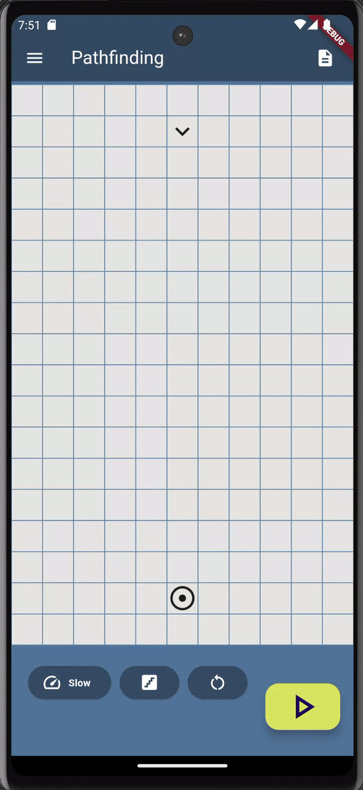
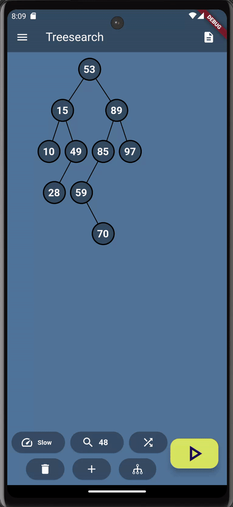

# AlgoVerse

A mobile application to visualizes a variety of algorithms. Pathfinding, sorting and binary search tree is visualized.
This application was developed in flutter.

## Pathfinding

A coordinate system is shown with a start and end node. The app visualizes the visited nodes and the path taken. It is possible to set obstacles or a random maze.

### Algorithms:

- A\*
- Dijkstra
- BFS
- DFS

### Screenshots:

## Sorting

An array is shown that can be sorted. The input can be a self set array or random array.   

## Algorithms:

- Mergesort
- Bubblesort
- Insertionsort
- Quicksort
- Selectionsort

### Screenshots:

## Binary Tree Search

A binary search tree will be displayed. It is possible to add random nodes, set your own tree and set randoms trees. It is possible to search for a value in the tree.

## Algorithms:
- BFS
- DFS
- Binary search

## Screenshots
